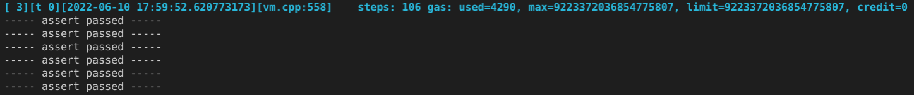

# TON NFT Auction
Special NFT Auction Smart contract for [TON](https://ton.org/) blockchain.

## 1. Solution Overview

Problem statement can be found [here](https://telegra.ph/TON-NFT-Auction-Contract-Product--Technical-Requirements-06-03)

Solution github repository: [link](https://github.com/sergey-msu/nft-auction)

Implementation peculiarities:

1. Auction contract fees and commissions can be set in such a way that its own balance (the balance of the contract minus the current bid) is slightly increased with any operation with it. Thus, operations with a contract cannot reset its balance.
2. The minimum ``min_storage_fee`` has been introduced to the contract. Transactions leading to a decrease in the contract balance below this value are not accepted.

Top-level constants:

**min_gas_amount()** = 0.05 TON\
**int min_tons_for_storage()** = 0.1 TON\
**int transfer_invoke_fee()** = 0.05 TON\
**fwd_fee** = to be set dynamically as forward fee from current message

## 2. Expected Exit Codes:

- **447** - initial gas safeguard violation. Should be:\
``msg_value >= min_gas_amount()``
- **450** - trying to make a bid less than min_bid. Should be:\
``msg_value >= min_bid_value + min_gas_amount()``
- **458** - trying to cancel auction from address different from ``nft_address`` of ``marketplace_address``
- **478** - trying to finish auction from address different from ``nft_address`` (before deadine)
- **500** - trying to make a first call to uninitialized auction from address different from ``nft_address``
- **501** - trying to make a first call to uninitialized auction with wrong operation code
- **600** - trying to finish or cancel auction that already finished
- **800** - trying to finish auction with insufficient balance. Should be:\
``my_balance > min_gas_amount() + min_tons_for_storage() + transfer_invoke_fee() + fwd_fee``
- **801** - the same as 800 but in case of existing bidder. Auction balance should be:\
``my_balance > royalty_amount + marketplace_fee + min_gas_amount() + min_tons_for_storage() + transfer_invoke_fee() + 4*fwd_fee``
- **810** - trying to cancel auction with insufficient balance. Should be:\
``my_balance > min_gas_amount() + min_tons_for_storage() + transfer_invoke_fee() + fwd_fee``
- **811** - the same as 810 but in case of existing bidder. Auction balance should be:
``my_balance > min_gas_amount() + min_tons_for_storage() + transfer_invoke_fee() + 2*fwd_fee``

## 3. Project Structure:

1. ``docs/`` - project docs
2. ``secrets/`` - test wallets private keys. One single key ``wallet.pk`` is used for all test wallets here just for convenience.
3. ``src/contracts/`` - func smart contract. Auction contract - ``nft-auction.fc``. The rest are taken from [standard](https://github.com/ton-blockchain/token-contract/tree/main/nft).
4. ``src/requests/`` - fift API TON blockchain scripts 
5. ``src/tests/integration`` - integration tests, i.e. a simple python CLI auction demo (see below).
6. ``src/tests/unit`` - fift unit tests.

## 4. Project Set-Up

To run unit tests on local PC and demonstrate the functionality of the auction in testnet, it is neccessary to have

1. Ubuntu 20+ -based linux local.
2. Python 3.
3. TON blockchain local environment [sources](https://github.com/newton-blockchain/ton) (compiled func and fift interpretators) - [installation](https://github.com/raiym/astonished/blob/master/Dockerfile).

Clone github project:\
``>  git clone git@github.com:sergey-msu/nft-auction.git``

Go to ``src/tests/integration/configs`` and change the following values in ``app.yaml``\
``fift_path: '/opt/ton/crypto/fift'``\
``fift_executer_path: '/opt/liteclient-build/crypto/fift'``\
``func_compiler_path: '/opt/liteclient-build/crypto/func'``\
to your correct paths.

## 5. Run Unit Tests

Go to ``src/`` folder and run bash script:

``>  cd src/``\
``>  ./unit-tests.sh``

After a couple of seconds you should see a tests passed message:

## 6. Demo

See [here](docs/demo.md).
