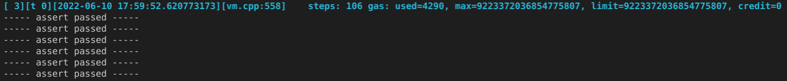

# TON NFT Auction
Special NFT Auction Smart contract for [TON](https://ton.org/) blockchain.

## 1. Solution Overview

Problem statement: https://telegra.ph/TON-NFT-Auction-Contract-Product--Technical-Requirements-06-03
Solution rerository: https://github.com/sergey-msu/nft-auction

Implementation peculiarities:

1. Auction contract commissions can be set in such a way that the auction's own balance (the balance of the contract minus the current bid) is slightly increased with any operation with it. Thus, operations with a contract cannot reset its balance.
2. The minimum ``min_storage_fee`` has been introduced. Transactions leading to a decrease in the contract balance below this value are not accepted.

Top-level constants:

> **min_gas_amount()** = 0.05 TON
**int min_tons_for_storage()** = 0.1 TON
**int transfer_invoke_fee()** = 0.05 TON
**fwd_fee** = to be set dynamically as forward fee from current message

Expected exit codes:

> **447** - initial gas safeguard violation. Should be:
``msg_value >= min_gas_amount()``
**450** - trying to make a bid less than min_bid. Should be:
``msg_value >= min_bid_value + min_gas_amount()``
**458** - trying to cancel auction from address different from ``nft_address``
**478** - trying to cancel auction from address different from ``nft_address`` of ``marketplace_address``
**500** - trying to make a first call to uninitialized auction from address different from ``nft_address``
**501** - trying to make a first call to uninitialized auction with wrong operation code
**600** - trying to finish or cancel auction that already finished
**800** - trying to finish auction with insufficient balance. Should be:
``my_balance > min_gas_amount() + min_tons_for_storage() + transfer_invoke_fee() + fwd_fee``
**801** - the same as 800 but in case of existing bidder. Auction balance should be:
``my_balance > royalty_amount + marketplace_fee  min_gas_amount() + min_tons_for_storage() + transfer_invoke_fee() + 4*fwd_fee``
**810** - trying to cancel auction with insufficient balance. Should be:
``my_balance > min_gas_amount() + min_tons_for_storage() + transfer_invoke_fee() + fwd_fee``
**811** - the same as 810 but in case of existing bidder. Auction balance should be:
``my_balance > min_gas_amount() + min_tons_for_storage() + transfer_invoke_fee() + 2*fwd_fee``

Project structure:

1. ``docs/`` - project docs
2. ``secrets/`` - test wallets private keys. One single key ``wallet.pk`` is used for all test wallets here just for convenience.
3. ``src/contracts/`` - func smart contract. Auction contract - ``nft-auction.fc``. The rest are taken from [standard](https://github.com/ton-blockchain/token-contract/tree/main/nft).
4. ``src/requests/`` - fift API TON blockchain scripts 
5. ``src/tests/integration`` - integration tests, i.e. a simple python CLI auction demo (see below).
6. ``src/tests/unit`` - fift unit tests.

## 1. Project Set-Up

Для прогона юнит тестов на локали и демонстрации функционала аукциона в testnet потребуется:

1. Ubunty 20+
2. Python 3
3. TON blockchain local environment [sources](https://github.com/newton-blockchain/ton) (compiled func and fift interpretators) - [installation](https://github.com/raiym/astonished/blob/master/Dockerfile)

Clone github project:
``>  git clone git@github.com:sergey-msu/nft-auction.git``

Go to ``src/tests/integration/configs`` and change the following values in ``app.yaml``
``fift_path: '/opt/ton/crypto/fift'``
``fift_executer_path: '/opt/liteclient-build/crypto/fift'``
``func_compiler_path: '/opt/liteclient-build/crypto/func'``
to your correct paths.

## 2. Run Unit Tests

Go to ``src/`` folder and run bash script:
``>  cd src/``
``>  ./unit-tests.sh``

After a couple of seconds you should see a tests passed message:

## 3. Demo

Testing is more 

Testing is a slightly better done in [whales sandbox](https://sandbox.tonwhales.com/explorer), because it conveniently groups incoming and outgoing transactions and also displays exit error codes.

For convenience of testing some wallets are deployed and supplied with test coins:

- [EQBR94p4TAivOi9mpGIoi-U2OH_TwuP01GfBtXf9QLMt_xBs](https://sandbox.tonwhales.com/explorer/address/EQBR94p4TAivOi9mpGIoi-U2OH_TwuP01GfBtXf9QLMt_xBs) - main wallet that sends all the command transactions to auction, marketplace et.
- [EQBFC3N-lJCkoxdKTzL6SsIzDMz8_A5x1zo3hgLbraTTN0hB](https://sandbox.tonwhales.com/explorer/address/EQBFC3N-lJCkoxdKTzL6SsIzDMz8_A5x1zo3hgLbraTTN0hB) - bidder #1 wallet
- [EQDj86RXZrSzO-MN5gjgRjuMDucqATYq2kcamMQZZhAbY4j0](https://sandbox.tonwhales.com/explorer/address/EQDj86RXZrSzO-MN5gjgRjuMDucqATYq2kcamMQZZhAbY4j0) - bidder #2 wallet

All the wallets have the same private key ``secrets/wallet.pk``.

Let's create an NFT item, auction and try to place some bids.

``>  cd src/``

Below is step-by-step demo guide.

### 3.1 Create an NFT collection:

``>  python3 -m demo-tests collection deploy --seed 12345``

Change seed to get other collections.

Check that the collection was deployed normally by invoke its contract get method (use your collection's address):

``>  python3 -m demo-tests collection info --addr EQCkqt2qxocFCSxntUVWkzNpM_jRReCNVtaY47QQtNW4VEvK``

### 3.2 Mint NFT Item

The following command will deploy NFT from previously created collection with appropriate index: 

``>  python3 -m demo-tests item mint --coll_addr EQCkqt2qxocFCSxntUVWkzNpM_jRReCNVtaY47QQtNW4VEvK --index 0``

Count to 10 and check NFT info (use your address of newly minted NFT):

``>  python3 -m demo-tests item info --addr EQAKX9FaRnupng_-Qi2QpvYzYsA_DKXh7MiaTikyx5aodS90``

### 3.3 Use NFT marketplace:

Marketplace with default parameter is already deployed to Whales sandbox: 
https://sandbox.tonwhales.com/explorer/address/EQDY2SwQsRuFa_JJZkVMiUtCXh7Eld35lGNLU8kqjlrhRQAW
so one can simply use ``EQDY2SwQsRuFa_JJZkVMiUtCXh7Eld35lGNLU8kqjlrhRQAW`` address without deploying new one.

### 3.4 Deploy new auction!

By now we have an NFT ``EQAKX9FaRnupng_-Qi2QpvYzYsA_DKXh7MiaTikyx5aodS90`` from 3.2 and markeplace from 3.3. Let's deploy new auction by running command

``>  python3 -m demo-tests auction new --seed 12345 --item EQAKX9FaRnupng_-Qi2QpvYzYsA_DKXh7MiaTikyx5aodS90``

Check auction info after some time:

``>  python3 -m demo-tests auction info --addr EQAkZY7zoqEi_GhydU2reugEPixy5MNWHZ02Kmci4HRmVEAZ``

One can see ``'nft_owner_address': None``. It means that auction was deployed by marketplace but not initialized by its NFT yet.
Let's get do it.

### 3.5 Start auction

Let's start deployed auction by send message from NFT by CLI command:

``>  python3 -m demo-tests auction start --addr EQAkZY7zoqEi_GhydU2reugEPixy5MNWHZ02Kmci4HRmVEAZ``

Check auction info after some time:

``>  python3 -m demo-tests auction info --addr EQAkZY7zoqEi_GhydU2reugEPixy5MNWHZ02Kmci4HRmVEAZ``

Here we see ``'nft_owner_address': EQBR94p4TAivOi9mpGIoi-U2OH_TwuP01GfBtXf9QLMt_xBs`` which means that NFT has approved the auction and it's started.

### 3.6 Cancel auction

Before try to make any bids let's try cancel newly created auction.
This can be simply done by a command

``>  python3 -m demo-tests auction cancel --addr EQAkZY7zoqEi_GhydU2reugEPixy5MNWHZ02Kmci4HRmVEAZ``

Let's check auction info:

``>  python3 -m demo-tests auction info --addr EQAkZY7zoqEi_GhydU2reugEPixy5MNWHZ02Kmci4HRmVEAZ``

Yep, it is cancelled, finished and can not be re-opened any more. Also note that NFT was returned to its previous owner:

``>  python3 -m demo-tests item info --addr EQAKX9FaRnupng_-Qi2QpvYzYsA_DKXh7MiaTikyx5aodS90``

``'owner_address': 'EQBR94p4TAivOi9mpGIoi-U2OH_TwuP01GfBtXf9QLMt_xBs'``

### 3.7 Create new auction and place a bid

Let's create another auction for the same NFT (please note different auction seed below):

``>  python3 -m demo-tests auction new --seed 67890 --item EQAKX9FaRnupng_-Qi2QpvYzYsA_DKXh7MiaTikyx5aodS90``

``Auction address: EQDtS4K3ZJDknk7lG9fc3RkntdUyVfCKBvaXBblBLoqAIxfR``

Start newly created auction:

``>  python3 -m demo-tests auction start --addr EQDtS4K3ZJDknk7lG9fc3RkntdUyVfCKBvaXBblBLoqAIxfR``

It's time to place a bid. 
Bid can be done as a simple transaction with sufficient amount.
Here for convenience we will use the same python CLI as before.

Let's place a bid of 2 TON from default wallet ``EQBR94p4TAivOi9mpGIoi-U2OH_TwuP01GfBtXf9QLMt_xBs`` (It's also NFT owner address, but who cares - we can do so).

``>  python3 -m demo-tests auction bid --addr EQDtS4K3ZJDknk7lG9fc3RkntdUyVfCKBvaXBblBLoqAIxfR --bidder_addr EQBR94p4TAivOi9mpGIoi-U2OH_TwuP01GfBtXf9QLMt_xBs --amount 2000000000``

Count to 10 and check auction's info:

``>  python3 -m demo-tests auction info --addr EQDtS4K3ZJDknk7lG9fc3RkntdUyVfCKBvaXBblBLoqAIxfR``

Here we can see our current bid:

``'curr_winner_address': 'EQBR94p4TAivOi9mpGIoi-U2OH_TwuP01GfBtXf9QLMt_xBs',``
``'curr_winner_bid': 1950000000,``

The bid set is slightly less than 2 TON due to commissions.
Great! Let's place another one.

### 3.8 Place an overbid

Let's place another bid thar overbids previos one. Use another default wallet, say ``EQBFC3N-lJCkoxdKTzL6SsIzDMz8_A5x1zo3hgLbraTTN0hB``.

``>  python3 -m demo-tests auction bid --addr EQDtS4K3ZJDknk7lG9fc3RkntdUyVfCKBvaXBblBLoqAIxfR --bidder_addr EQBFC3N-lJCkoxdKTzL6SsIzDMz8_A5x1zo3hgLbraTTN0hB --amount 3000000000``

Auction info says that now we have another current winner

``'curr_winner_address': 'EQBFC3N-lJCkoxdKTzL6SsIzDMz8_A5x1zo3hgLbraTTN0hB',``
``'curr_winner_bid': 2950000000,``

which is correct.

We can also  check the result in auction's wallet explorer: 
https://sandbox.tonwhales.com/explorer/address/EQDtS4K3ZJDknk7lG9fc3RkntdUyVfCKBvaXBblBLoqAIxfR

which tells us that previous bid has been returned to previous bidder. Great!

### 3.9 Place an underbid

It is neccesary to know that one must overbid not only visible current value but also fome auction fees. Current bid is 2950000000 nTON. If one wants to overbid this bid he must bid not less than

2950000000 + bid_step + min_gas_amount() + min_tons_for_storage() + transfer_invoke_fee() + 4*fwd_fee
royalty_amount + marketplace_fee

which is approximately equals to 360000000 nTON. Let's bid amount less than that:

``>  python3 -m demo-tests auction bid --addr EQDtS4K3ZJDknk7lG9fc3RkntdUyVfCKBvaXBblBLoqAIxfR --bidder_addr EQBR94p4TAivOi9mpGIoi-U2OH_TwuP01GfBtXf9QLMt_xBs --amount 3150000000``

The bid returns to bidder except some fees:

https://sandbox.tonwhales.com/explorer/address/EQBR94p4TAivOi9mpGIoi-U2OH_TwuP01GfBtXf9QLMt_xBs

### 3.10 Finish Auction

Finally, let's finish our auction.
Simply execue the command

``>  python3 -m demo-tests auction finish --addr EQDtS4K3ZJDknk7lG9fc3RkntdUyVfCKBvaXBblBLoqAIxfR``

Great! All the commissins are payed. Also note that auction has positive balance > 0.13 TON which is sufficient to cover it;s storage fees for a years.
