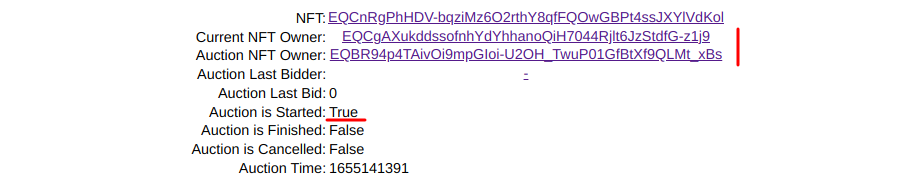

# TON NFT Auction Demo

[Here](http://51.250.107.146:8051/) is the auction testing sandbox.

We will use [whales sandbox](https://sandbox.tonwhales.com/explorer) as the backend for demonstration site as it conveniently groups incoming and outgoing transactions and also displays exit error codes.

For convenience of testing some wallets are already deployed and supplied with test coins:

- [EQBR94p4TAivOi9mpGIoi-U2OH_TwuP01GfBtXf9QLMt_xBs](https://sandbox.tonwhales.com/explorer/address/EQBR94p4TAivOi9mpGIoi-U2OH_TwuP01GfBtXf9QLMt_xBs) - main wallet that sends all the command transactions to auction, marketplace et.
- [EQBFC3N-lJCkoxdKTzL6SsIzDMz8_A5x1zo3hgLbraTTN0hB](https://sandbox.tonwhales.com/explorer/address/EQBFC3N-lJCkoxdKTzL6SsIzDMz8_A5x1zo3hgLbraTTN0hB) - bidder #1 wallet
- [EQAJbWNw7QmNi3I2kAPGELcvc-u_LEVnSSee9KrsB23LbgwL](https://sandbox.tonwhales.com/explorer/address/EQAJbWNw7QmNi3I2kAPGELcvc-u_LEVnSSee9KrsB23LbgwL) - bidder #2 wallet

All the wallets have the same private key ``secrets/wallet.pk``.

We also will use hard-coded marketplace [EQDY2SwQsRuFa_JJZkVMiUtCXh7Eld35lGNLU8kqjlrhRQAW](https://sandbox.tonwhales.com/explorer/address/EQDY2SwQsRuFa_JJZkVMiUtCXh7Eld35lGNLU8kqjlrhRQAW) by default. One can change it to its own later in auction settings below.

OK, let's get started 🦕.
Let's create an NFT Collection, then item and finally auction, and try to place some bids.
It's important to wait for a while (~5-20 sec) *after each operation* with blockchain to see it's results. 

### 1. Create an NFT Collection:

Click **Deploy New** button just below Collection header.
The address of a new colleciton will immediately appear below, but it's important to wait a couple of seconds to let collection been deployed. You can track this process in blockchain explorer by clicking on address link:

### 2. Mint NFT Item

Then mint NFT item the same way as collection above. Note that field ``Collection Address`` already filled by newly created collection address, by pressing **Mint New** button:

### 3. Deploy ans Start new Auction!

The ``NFT Address`` field should already be filled by newly minted NDT item.
Now everything is ready to start new auction.

A couple of thing should be mentioned here. ``Auction Deadline, sec`` field can be left empty - then there will be no deadline time after which auction is forcibly finished. For testing purposes it's convenient to use ``now`` button link right to this field. It fills it with Unix UTC now value, to wich we can then add some seconds to properly test auction deadline (say, 120 for 2 minutes delay). Then, ``Max bid, TON`` field also can be left empty. It's also worth noting that all coin amoin fields are measured in TONs here, not  nano TONS, so fractional numbers are also allowable, e.g. ``5.67``.

OK, let's fill in all the fields with neccecary values (Auction Deacline leave empty for now), press ***Deploy New** button and wait some time:

Check auction status by pressing **Info** button:

As we can see auction is not started yet. Press **Start** button (this will send transaction from NFT contract to auction), count to 10 and press **Info** again:

As we can see, auction has been started and also NFT owner has been changed from initial (real) owner, to auction contract address. Great! 🥳

### 4. Place a Bid

It's time to place some bids. This can be done in two ways:
1. One can use simple transaction from his wallet (need to create one in Whales' sandbox and get test coins via bot @sandbox_faucet_bot)
2. Use hard-coded wallets: Wallet #1,2,3 from the left pane.

Let's fill ``Bidder Address`` and ``Bid`` fields with Wallet #2 address ``EQBFC3N-lJCkoxdKTzL6SsIzDMz8_A5x1zo3hgLbraTTN0hB`` and ``1.5`` value, and then press the TON crystall. Pressing **Info** button after some time will show us the result:

We can see correct ``Auction Last Bidder`` and ``Auction Last Bid`` values.

### 5. Overbid

Let's make another bid from another wallet, say ``4`` TON Wallet #3. We will get the following results:

We can see that last bidder and last bid walues have changed to new ones and also explorer says the previous bid has returned to the first bidder. Great!

### 6. Finish Auction

Finally, let's finish our auction.
Just push red **Finish** button, count to 15 and check auction contract state and explorer:

Great 🥳🎉🎊! All the fees are payed. Also note that auction has positive balance > 0.13 TON which is sufficient to cover it's storage fees for a years.

All other use-cases (anti-sniping, auction finishing by deadline etc.) can also be tested this way. Have fun!
